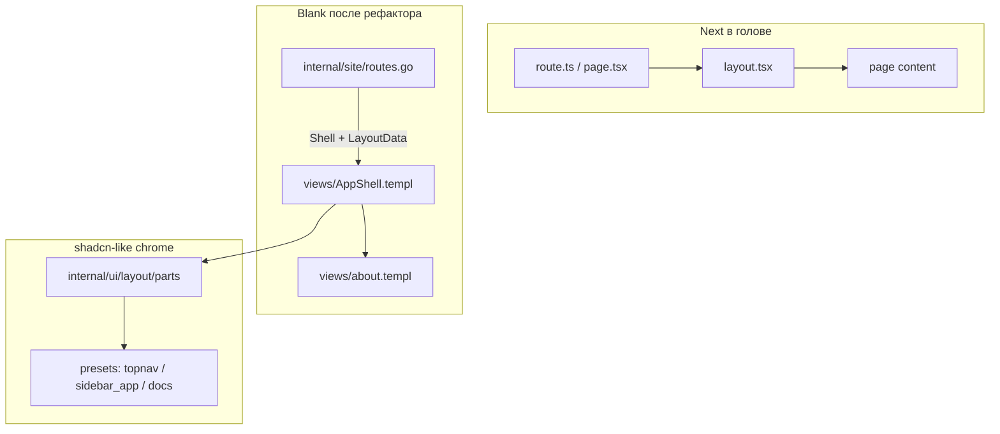

# Blank для React-разработчика: рефакторинг роутов и layout

> **Статус:** исторический брейншторм (Phase-планирование Block 01–05).
> Действующая модель — **page composes layout**: см. [`specs/page-composes-layout.md`](specs/page-composes-layout.md). Маршрут больше не выбирает layout-адаптер; страница сама композирует `@layout.Shell` или `@layout.SidebarShell`.

Ниже — как **перестроить Blank**, чтобы человек из **Next App Router + shadcn/ui** за один день понял «где что лежит» и мог добавлять страницы без чтения всего Go-стека.

---

## Что он видит сегодня (и где путается)

Сейчас Blank уже близок к SSR-Next, но **точки входа размазаны**:

| Next / shadcn | Blank сейчас | Боль для фронта |
|---------------|--------------|-----------------|
| `app/layout.tsx` | `views/layout.templ` → `ui/layout/shell.templ` | Два слоя layout без явных имён |
| `app/page.tsx` | `views/home.templ` | Ок |
| `app/(marketing)/layout.tsx` | **нет** — один `SiteShell` на всё | Непонятно, как сделать landing без nav |
| `middleware.ts` | framework locales + security в `serverapp` | Ок, но неочевидно |
| Route | `site/feature.go` — route + fixture + layout + render | **Всё в одном Go-файле** |
| shadcn `components/ui/sheet` | `ui/layout` — legacy `data-ui8kit-dialog-*` | Другой API, чем в `@Templ/examples` |
| `messages/en.json` | `fixtures/locale/en.json` + Go struct | Два места правки copy |
| `sidebar` layout | отдельная ветка / BlankSidebar | «Где мой sidebar?» |

Типичный handler сегодня:

```123:131:e:\_@Go\@Blank\internal\site\feature.go
func (f *Feature) getHome(w http.ResponseWriter, r *http.Request) {
	ctx := r.Context()
	fix := f.fixtureLocale(ctx)
	data := f.layoutData(ctx, r, fix, fix.Home.Title, "/")
	_ = web.Render(ctx, w, views.SiteShell(data, views.HomePage(views.HomeData{
		Welcome:      fix.Home.Welcome,
		...
	})))
}
```

React-разработчик ожидает: **route → layout → page**, а не «5 строк boilerplate в Go на каждую страницу».

---

## Целевая mental model (одна картинка)



**Правило для онбординга:** фронт **ежедневно** трогает `views/*.templ` и `fixtures/locale/*.json`; Go в `site/` — **тонкий роутинг**; chrome — `internal/ui/layout/` (как `components/ui/*` в shadcn).

---

## Карта папок «как в Next»

Добавьте в `docs/for-react-devs.md` (или отдельный `docs/routing-and-layouts.md`) такую таблицу — это главный onboarding-артефакт:

| Next App Router | shadcn | Blank (целевое) |
|-----------------|--------|-----------------|
| `app/layout.tsx` | — | `internal/ui/layout/shell.templ` + `layout/parts/*` |
| `app/(app)/layout.tsx` | `SidebarProvider` | `views/layout_app.templ` → `AppShell` |
| `app/(marketing)/layout.tsx` | minimal header | `views/layout_marketing.templ` → `MarketingShell` |
| `app/(docs)/layout.tsx` | toc + content | `views/layout_docs.templ` → `DocsShell` |
| `app/**/page.tsx` | block content | `internal/views/<page>.templ` |
| `components/ui/*` | shadcn primitives | `github.com/fastygo/templ/ui` + `templ/components` |
| `components/*` (app) | local UI | `internal/ui/components/*` |
| `blocks/*` (copy-paste) | shadcn blocks | `internal/ui/blocks/*` (staging) + `@Templ/examples` |
| `middleware.ts` | — | `internal/serverapp/app.go` (locales, security) |
| `next.config` | — | `fastygo.config.mjs` |
| `messages/*.json` | — | `internal/fixtures/locale/*.json` |

**Views vs layout registry** (частый вопрос):

- `internal/ui/layout/` — **переиспользуемый chrome** (Shell, Aside, Sheet, NavList). Как shadcn sidebar block.
- `internal/views/` — **продуктовая склейка**: какой preset, какие assets, `{children}` страницы. Как ваши `app/(app)/layout.tsx`.

---

## Рефакторинг по фазам (онбординг-first)

### Фаза 0 — документация без кода (1–2 часа)

Обновить `for-react-devs.md`:

1. Три шага «добавить страницу» с **именами файлов**, не абстракциями.
2. Диаграмма request flow: `GET /about` → `site` → `AppShell` → `AboutPage`.
3. Явно: **`SiteShell` = `AppShell`** (alias), preset сейчас `topnav`.
4. Sidebar — preset `sidebar_app`, не отдельный репозиторий (roadmap).

React-разработчик должен открыть **один** doc и понять дерево.

---

### Фаза 1 — именованные layouts в `views/` (минимальный diff)

**Цель:** узнаваемые имена как в Next route groups.

```templ
// internal/views/layout.templ (концепт)

templ AppShell(d LayoutData, body templ.Component) {
  @layout.Shell(layout.FromPreset(layout.PresetTopNav, toShellProps(d))) { @body }
}

templ MarketingShell(d LayoutData, body templ.Component) {
  @layout.Shell(layout.FromPreset(layout.PresetMarketing, toShellProps(d))) { @body }
}

templ DocsShell(d LayoutData, body templ.Component) {
  @layout.Shell(layout.FromPreset(layout.PresetDocs, toShellProps(d))) { @body }
}

// backward compat
templ SiteShell(d LayoutData, body templ.Component) {
  @AppShell(d, body)
}
```

**Онбординг-win:** в handler пишется `views.AppShell` или `views.MarketingShell` — сразу видно тип страницы.

Файлы `layout_marketing.templ` / `layout_app.templ` — опционально; на старте хватит **одного `layout.templ` с тремя функциями**.

---

### Фаза 2 — тонкий роутинг (главный DX для фронта)

**Проблема:** `feature.go` смешивает nav, i18n, layout data и render.

**Решение:** разнести как «route table + page render helper».

```
internal/site/
  feature.go      # Feature, Routes(), wiring
  render.go       # RenderPage(w, r, PageSpec)
  routes.go       # декларативная таблица маршрутов
  nav.go          # siteNav, navigationProps
  layout_data.go  # layoutData()
```

**`PageSpec`** — то, что React-dev читает как «конфиг страницы»:

```go
type PageSpec struct {
    Method     string // "GET"
    Pattern    string // "/about"
    Active     string // "/about"
    Title      func(fix fixtures.Locale) string
    Shell      views.ShellRenderer // AppShell | MarketingShell | DocsShell
    Body       func(fix fixtures.Locale) templ.Component
    Nav        bool // включать в siteNav
}
```

**`routes.go`** — аналог файловой структуры `app/`:

```go
var pages = []PageSpec{
    {
        Pattern: "/{$}",
        Active:  "/",
        Title:   func(f fixtures.Locale) string { return f.Home.Title },
        Shell:   views.AppShell,
        Body:    func(f fixtures.Locale) templ.Component {
            return views.HomePage(views.HomeData{...})
        },
        Nav: true,
    },
    // GET /pricing → MarketingShell, Nav: false
}
```

Handler становится одной строкой:

```go
func (f *Feature) Routes(mux *http.ServeMux) {
    for _, p := range pages {
        mux.HandleFunc(p.Method+" "+p.Pattern, f.handlePage(p))
    }
}
```

**Онбординг-win:** новая страница = **одна запись в `routes.go`** + **`views/foo.templ`** + **JSON keys** — без копипасты `layoutData` в каждом handler.

---

### Фаза 3 — layout parts + presets (shadcn Sidebar)

**Цель:** один chrome, как `cmp.Sheet` в `@Templ/examples/ui/blocks/home`.

```
internal/ui/layout/
  shell.templ           # document + composer
  parts/
    aside_region.templ
    main_column.templ
    mobile_sheet.templ  # cmp.Sheet, не raw dialog hooks
    nav_list.templ
    shell_band.templ    # header/footer slots
  presets.go            # PresetTopNav, PresetSidebarApp, PresetDocs
  props.go
  layout.spec.md        # по templ-component-spec
```

**`fastygo.config.mjs`** (только для starter):

```js
app: {
  layout: "topnav", // topnav | sidebar_app — default preset для AppShell
}
```

Это **не** заменяет route-level `MarketingShell` — только default для app-зоны.

**Онбординг-win:** фронт знает shadcn `Sheet`, `SheetTrigger`, `Nav` — те же имена в `templ/components`.

---

### Фаза 4 — route groups через features (когда приложение растёт)

Пока 2 страницы — достаточно одного `site` feature + разные `Shell` в `PageSpec`.

Когда появятся **marketing / app / docs** как отдельные зоны:

```
internal/
  site/           # публичные страницы, MarketingShell
  app/            # workspace, AppShell (sidebar)
  docs/           # DocsShell
  serverapp/app.go  # WithFeature(site), WithFeature(app), WithFeature(docs)
```

Это ближе к Next:

- `(marketing)/` → `internal/site`
- `(app)/` → `internal/app`
- `(docs)/` → `internal/docs`

**Не делать сразу** — для Blank starter это overkill. Ввести, когда >1 layout group с разной nav.

---

### Фаза 5 — blocks остаются catalog, не runtime

`@Templ/examples/ui/blocks/home|dashboard` — **copy-paste wireframes**, не импорт в `views`.

Product path:

```text
AppShell → HomePage (content only)
```

Catalog path:

```text
home.Page(defaults)  // полный scaffold для examples
```

**Онбординг-win:** в README явно: «blocks = shadcn blocks folder, не pages».

---

## Cookbook для React-разработчика (после рефактора)

### 1. Новая страница в app-зоне (как `app/dashboard/page.tsx`)

1. `internal/fixtures/locale/en.json` + `ru.json` — ключи страницы.
2. `fixtures.go` — поле в `Locale` (если typed).
3. `internal/views/pricing.templ` — **только контент**, без header/footer.
4. `internal/site/routes.go` — одна `PageSpec` с `Shell: views.AppShell`.
5. `nav.go` — пункт меню (или `Nav: true` в spec).
6. F5 (templ/CSS) или restart Go (только если меняли `routes.go`).

### 2. Landing без sidebar (как `(marketing)/`)

```go
Shell: views.MarketingShell,
Nav:   false,
```

### 3. Сменить layout всего app

`fastygo.config.mjs` → `layout: "sidebar_app"` **или** правка preset в `AppShell` — не трогать каждую страницу.

### 4. Кастомный header на одной странице

shadcn-way: **slot**, не prop string:

```templ
// views/layout_app.templ — опциональный MainHeader slot в LayoutData
type LayoutData struct {
    ...
    MainHeader templ.Component // nil → default PageHeader
}
```

---

## Что переименовать для узнаваемости

| Было | Стало | Зачем |
|------|-------|-------|
| `SiteShell` | `AppShell` (+ alias `SiteShell`) | как `(app)/layout` |
| `layout.Shell` | оставить | root document layout |
| `getHome`, `getSample` | генерируются из `routes.go` | меньше Go |
| `layoutData()` | `NewLayoutData(ctx, r, opts)` | явные опции (shell, title, active) |
| ветка `sidebar` | preset `sidebar_app` | один репо, один onboarding |

---

## Что **не** трогать в первом рефакторе

- `devoverlay` — отдельный пакет, не смешивать с site layout.
- `internal/ui/blocks/*` — пустые stubs, заполнять позже.
- Полный `LayoutSpec` engine с 10 осями — достаточно **3 preset + parts**.
- Auto-restart Go в dev — nice-to-have, не блокер; честно писать в docs «restart after routes.go».

---

## Порядок работ (рекомендуемый PR-план)

| PR | Содержание | Онбординг-эффект |
|----|------------|------------------|
| 1 | `AppShell` / `MarketingShell` / `DocsShell` stubs + docs | Имена как в Next |
| 2 | `site/render.go` + `routes.go`, убрать дубли handlers | «Добавь строку в routes» |
| 3 | `layout/presets.go` + `FromPreset`, migrate topnav | Один composer |
| 4 | `cmp.Sheet` parts, sidebar preset (BlankSidebar merge) | shadcn parity |
| 5 | Optional: split `site` / `app` features | Route groups |

---

## Одна фраза для README / for-react-devs

> **Routes live in `internal/site/routes.go`. Pages live in `internal/views/*.templ`. Layouts are `AppShell` / `MarketingShell` / `DocsShell` in `views/layout.templ`. Chrome components are in `internal/ui/layout/` (like shadcn `components/ui`). Copy lives in `fixtures/locale/*.json`.**

Это ровно то, что React-разработчик ищет в первые 10 минут.

---

## Решение по вашему вопросу «layout files vs route wrapper»

**Для Blank onboarding — оба, с разделением ролей:**

1. **`views/AppShell`, `MarketingShell`, `DocsShell`** — named layouts (как `layout.tsx`).
2. **`site/routes.go` + `PageSpec.Shell`** — route-level выбор (как Next route groups).
3. **`APP_LAYOUT` в config** — только default preset для `AppShell`, не глобальный switch на все routes.

Так фронт не учит Go-паттерны — он учит **ту же схему, что в Next**, с другим синтаксисом.

Логичный первый PR — **Фаза 1 + 2** (named shells + `routes.go`/`render.go`) без тяжёлого layout engine: максимум пользы для onboarding при минимальном риске.