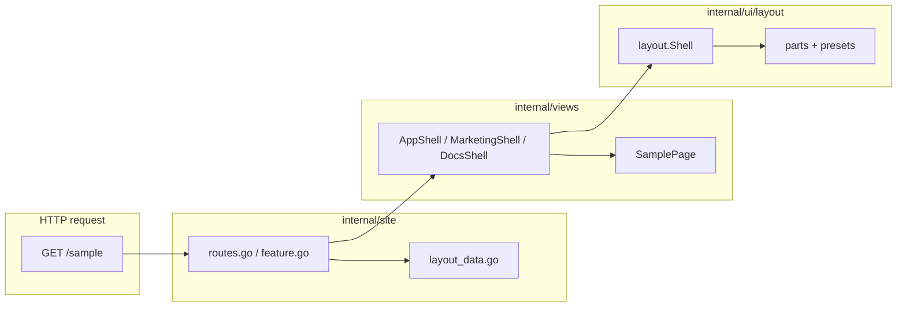

# Blank Next/shadcn Architecture

Durable architecture spec for the Blank refactor aimed at React developers who know **Next App Router** and **shadcn/ui**. This document freezes vocabulary and responsibilities before runtime changes.

**Status:** Block 00 complete — naming and boundaries are frozen.  
**Next slice:** Block 01 — named route shells (see [active.md](./active.md)).

---

## Intent

Blank is a **server-rendered BFF frontend** (Go + templ + Tailwind). React developers should onboard using the same mental model as Next:

```text
route -> route layout -> page content
```

They should **not** need to read framework internals to add a page, choose a layout, or understand where chrome vs page markup lives.

---

## Glossary

| Term | Blank location | Role |
|------|----------------|------|
| **Document shell** | `internal/ui/layout.Shell` | Full HTML document: `DOCTYPE`, `html`, `head`, `body`, asset hooks, top-level chrome composition, `@ui8kit/aria` markup hooks. Analogous to root `app/layout.tsx` document frame only — not route-group choice. |
| **Route shell / route layout** | `views.AppShell`, `views.MarketingShell`, `views.DocsShell` | Product-level wrapper that picks chrome geometry/preset and wraps `{children}` page body. Analogous to `app/(app)/layout.tsx`, `(marketing)/layout.tsx`, `(docs)/layout.tsx`. |
| **Page** | `internal/views/*.templ` (e.g. `HomePage`, `SamplePage`) | Route content only. Receives resolved props/strings. No fixture loading inside `.templ`. No header/footer/sidebar chrome. Analogous to `page.tsx`. |
| **Chrome** | `internal/ui/layout/*`, `internal/ui/components/*` | Reusable app shell UI: header, footer, nav, sidebars, mobile sheets, theme toggle, language switch. Analogous to shadcn `components/ui/*` used inside layouts. |
| **Layout part** | Future: `AsideRegion`, `MobileSheet`, `ShellBand`, `MainInset`, `SheetTrigger`, … | shadcn-like compound building blocks inside `internal/ui/layout/`. Composed by presets or manual `ShellProps` trees — not one giant variant enum. |
| **Preset** | Future: `PresetTopNav`, `PresetSidebarApp`, … | Small factory that assembles layout parts into a `ShellProps` skeleton. Starter DX only; route shells choose preset, not global config alone. |
| **Block / showcase** | `internal/ui/blocks/*`, `@Templ/examples/ui/blocks/*` | Copy-paste wireframe scaffolds (shadcn Blocks). **Not** product runtime. Product path: `AppShell -> HomePage`. Catalog path: `home.Page(defaults)`. |

### Two “layout” layers (common confusion)

| Layer | Name in docs | File today | Next analogy |
|-------|--------------|------------|--------------|
| 1 | Document shell | `internal/ui/layout/shell.templ` → `layout.Shell` | Root document + providers frame |
| 2 | Route shell | `internal/views/layout.templ` → `views.SiteShell` (→ `AppShell`) | Route group `layout.tsx` |

**Rule:** When onboarding says “layout”, specify **document shell** vs **route shell**.

---

## Next / shadcn mapping

| Next App Router | shadcn | Blank (target) |
|-----------------|--------|----------------|
| `next.config.ts` / `vite.config.ts` | — | [`fastygo.config.mjs`](../../fastygo.config.mjs) — **tooling only** |
| Root document | — | `internal/ui/layout.Shell` |
| `app/(app)/layout.tsx` | `SidebarProvider` + inset | `views.AppShell` |
| `app/(marketing)/layout.tsx` | minimal header | `views.MarketingShell` |
| `app/(docs)/layout.tsx` | toc + content | `views.DocsShell` |
| `app/**/page.tsx` | block content | `internal/views/<page>.templ` |
| `components/ui/*` | primitives | `github.com/fastygo/templ/ui` + `templ/components` |
| App components | local UI | `internal/ui/components/*` |
| shadcn blocks | copy-paste | `internal/ui/blocks/*` + Templ examples |
| Route table | file-based routes | `internal/site/routes.go` (target; today `feature.go`) |
| `middleware.ts` | — | `internal/serverapp/app.go` (locales, security) |
| `messages/*.json` | — | `internal/fixtures/locale/*.json` |

---

## Request flow



**Onboarding rule:** React devs touch **`internal/views/*.templ`** and **`fixtures/locale/*.json`** daily; **`internal/site/`** stays thin routing; chrome lives in **`internal/ui/layout/`**.

---

## Public naming (frozen)

| Symbol | Status | Meaning |
|--------|--------|---------|
| `views.AppShell` | **Target** | App-zone route layout (topnav today; sidebar preset later). |
| `views.MarketingShell` | **Target** | Public/landing layout (minimal nav, no sidebar). |
| `views.DocsShell` | **Target** | Docs layout (header + optional toc aside). |
| `views.SiteShell` | **Temporary alias** | Delegates to `AppShell` until call sites migrate. |
| `layout.Shell` | **Keep** | Document/chrome shell — do not rename to avoid colliding with route shells. |

---

## Layer responsibilities

### `internal/site/`

- HTTP route registration
- Locale resolution per request
- Building `views.LayoutData` from fixtures
- Choosing route shell + page component
- **Must not** contain page markup

### `internal/views/`

- Route shells (`*Shell`)
- Page templates (`*Page`)
- View models (`models.go`)
- **Must not** load fixtures inside `.templ`

### `internal/ui/layout/`

- Document shell and chrome parts
- Presets (future)
- Receives resolved props only
- Preserves `data-ui8kit-*` hooks for `@ui8kit/aria`

### `internal/fixtures/`

- Embedded locale JSON + typed `Locale`
- User-visible copy including ARIA labels for chrome

### `fastygo.config.mjs`

- Dev/build tooling: server env, templ, CSS, JS bundles, ui8px validation
- **Not** the route registry or primary layout switch for production routes

---

## Interaction policy (no custom JS)

- Covered patterns use **`@ui8kit/aria`** via committed `web/static/js/ui8kit.js` and [`manifest.json`](../../web/static/js/manifest.json).
- Mobile navigation/sheets use existing **dialog/sheet** hooks (`data-ui8kit`, `data-ui8kit-dialog-*`) or `templ/components` Sheet with `Behavior: "ui8kit"`.
- **`theme.js`** is allowed for theme toggle (existing app behavior).
- Do **not** add custom client state for sidebar collapse, cookie persistence, or keyboard shortcuts until a spec explicitly requires it and `@ui8kit/aria` does not cover the pattern.
- New manifest patterns require **`bun run build:js`** and **`bun run validate:aria`**.

---

## Non-goals (this refactor track)

| Item | Reason |
|------|--------|
| `routes.yaml` + codegen | Later DX layer; Go route manifest first |
| Custom JS for sidebar/sheet | Use `@ui8kit/aria` + templ Sheet |
| Icon-collapse sidebar + cookie state | shadcn parity deferred; wireframe phase |
| Full layout engine / JSON layout config | Use compound parts + presets + route shells |
| Split `site` / `app` / `docs` features | Only when multiple layout groups need different nav |
| `github.com/fastygo/blocks` / `widgets` deps | Staging stays in `internal/ui/*` |
| Go auto-restart in dev | Document honest restart-after-Go-change workflow |

---

## Sidebar direction (summary)

Sidebars are **regions**, not separate repos or branches:

- **Desktop:** static `aside` in layout grid
- **Mobile:** same nav content in `MobileSheet` + `SheetTrigger`
- **Geometry:** controlled by small enums (`AsideSide`, `AsideScope`, `Collapsible`, …) — see future `layout.spec.md`
- **Three wireframe images** are **showcase presets** (`sidebars_full`, `sidebars_main`, `sidebars_header`), not core runtime names

Reference implementations: `@Templ/examples/ui/blocks/home/page.templ`, `dashboard/page.templ`.

---

## One-line onboarding (target README phrase)

> **Routes live in `internal/site/routes.go`. Pages live in `internal/views/*.templ`. Route layouts are `AppShell` / `MarketingShell` / `DocsShell` in `views/layout.templ`. Chrome is in `internal/ui/layout/`. Copy lives in `fixtures/locale/*.json`.**

*(Today routes still live in `feature.go` until Block 02.)*

---

## Refactor sequence (progress driver)

See [next-shadcn-refactor-progress.md](../next-shadcn-refactor-progress.md) for copy-paste blocks.

| Block | Deliverable |
|-------|-------------|
| 00 | This spec |
| 01 | Named route shells + `SiteShell` alias |
| 02 | `routes.go` + render helper |
| 03 | React onboarding docs |
| 04–09 | Layout parts, presets, sidebar wiring |
| 10–11 | Tooling honesty + final verification |

---

## Block 00 completion notes

- **Completed:** Architecture glossary, naming, non-goals, and request-flow documented.
- **Baseline unchanged:** No runtime code modified in Block 00.
- **Next:** Implement Block 01 per [active.md](./active.md).
