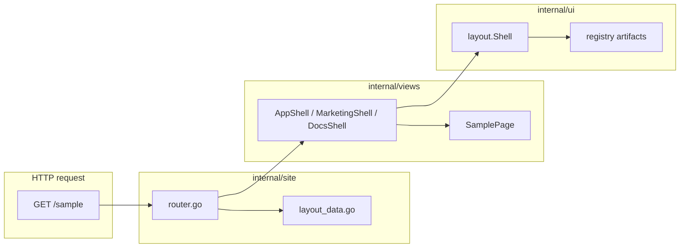
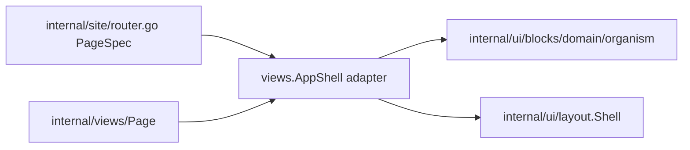

# Blank Next/shadcn Architecture

Durable architecture spec for the Blank refactor aimed at React developers who know **Next App Router** and **shadcn/ui**. This document freezes vocabulary and responsibilities before runtime changes.

**Status:** Block 09 complete — explicit per-route layout in `PageSpec.Layout`.  
**Next slice:** Block 10 — tooling config cleanup (see [active.md](./active.md)).

---

## Intent

Blank is a **server-rendered BFF frontend** (Go + templ + Tailwind). React developers should onboard using the same mental model as Next:

```text
route -> route layout -> page content
```

They should **not** need to read framework internals to add a page, choose a layout, or understand where chrome vs page markup lives.

---

## Glossary

| Term | Blank location | Role |
|------|----------------|------|
| **Document shell** | `internal/ui/layout.Shell` | Full HTML document: `DOCTYPE`, `html`, `head`, `body`, asset hooks, top-level chrome composition, `@ui8kit/aria` markup hooks. Analogous to root `app/layout.tsx` document frame only — not route-group choice. |
| **Route shell / route layout** | `views.AppShell`, `views.MarketingShell`, `views.DocsShell` | Temporary runtime adapters that wrap `{children}` page body. Analogous to `app/(app)/layout.tsx`, `(marketing)/layout.tsx`, `(docs)/layout.tsx`; later blocks move reusable UI mass into `internal/ui/*`. |
| **Page** | `internal/views/*.templ` (e.g. `HomePage`, `SamplePage`) | Route content only. Receives resolved props/strings. No fixture loading inside `.templ`. No header/footer/sidebar chrome. Analogous to `page.tsx`. |
| **Chrome** | `internal/ui/layout/*`, `internal/ui/components/*` | App-owned shell/frame UI: document shell, header, footer, nav, mobile sheet hosts, theme/language controls. `internal/ui/layout` stays in the app. |
| **Registry artifact** | `internal/ui/{components,blocks,widgets,variants,utils}` | Copy-pasteable or reusable UI mass accumulated in the app registry before extraction. This is the shadcn-like layer. |
| **Layout organism** | Usually `internal/ui/blocks/*` or `internal/ui/widgets/*` | Reusable composed UI such as sidebar app shell, dashboard shell, docs toc shell. It may compose `templ/ui`, `templ/components`, app components, and widgets. |
| **Block / showcase** | `internal/ui/blocks/*`, `@Templ/examples/ui/blocks/*` | Copy-paste wireframe scaffolds (shadcn Blocks). **Not** the runtime router itself. Runtime routes may choose adapters that render these artifacts. |

### Two “layout” layers (common confusion)

| Layer | Name in docs | File today | Next analogy |
|-------|--------------|------------|--------------|
| 1 | Document shell | `internal/ui/layout/shell.templ` → `layout.Shell` | Root document + providers frame |
| 2 | Route shell adapter | `internal/views/layout.templ` → `views.SiteShell` (→ `AppShell`) | Temporary route group adapter |

**Rule:** When onboarding says “layout”, specify **document shell** vs **route shell**.

---

## Next / shadcn mapping

| Next App Router | shadcn | Blank (target) |
|-----------------|--------|----------------|
| `next.config.ts` / `vite.config.ts` | — | [`fastygo.config.mjs`](../../fastygo.config.mjs) — **tooling only** |
| Root document | — | `internal/ui/layout.Shell` |
| `app/(app)/layout.tsx` | `SidebarProvider` + inset | `views.AppShell` |
| `app/(marketing)/layout.tsx` | minimal header | `views.MarketingShell` |
| `app/(docs)/layout.tsx` | toc + content | `views.DocsShell` |
| `app/**/page.tsx` | block content | `internal/views/<page>.templ` |
| `components/ui/*` | primitives | `github.com/fastygo/templ/ui` + `templ/components` |
| App components | local UI | `internal/ui/components/*` |
| shadcn blocks | copy-paste | `internal/ui/blocks/*` + Templ examples |
| Route table | file-based routes | `internal/site/router.go` |
| `middleware.ts` | — | `internal/serverapp/app.go` (locales, security) |
| `messages/*.json` | — | `internal/fixtures/locale/*.json` |

---

## Request flow



**Onboarding rule:** React devs touch **`internal/views/*.templ`** and **`fixtures/locale/*.json`** daily; **`internal/site/`** stays thin runtime routing; reusable UI mass lives in **`internal/ui/*`**.

---

## Registry boundary (frozen)

Three concepts must stay separate:

| Concept | Location | shadcn analogy |
|---------|----------|----------------|
| **Runtime wiring** | `internal/site/router.go` | Route table — chooses layout adapter + page |
| **Route shell adapter** | `views.AppShell`, `MarketingShell`, `DocsShell` | Next route-group `layout.tsx` wrapper |
| **Registry artifact** | `internal/ui/{components,blocks,widgets,…}` | Copy-paste blocks/components you accumulate |



**Rule:** Do not put reusable layout organisms in `internal/site/` or grow `views/layout.templ` into a layout engine. Routes **select** artifacts; artifacts **compose** markup.

### Where layout organisms live

Use **`internal/ui/blocks/<domain>/<organism>`** for props-only, copy-pasteable layout scaffolds (future `github.com/fastygo/blocks` candidates):

| Domain folder | Example organism | Use |
|---------------|------------------|-----|
| `blocks/dashboard/` | `app_shell`, `sidebar_app` | App/dashboard shell wireframes |
| `blocks/docs/` | `toc_shell` | Docs toc + content column |
| `blocks/marketing/` | `topnav_shell`, `landing_shell` | Public/landing layouts |

**Do not** create `internal/ui/blocks/layout/` — it collides with permanent app chrome in `internal/ui/layout/`.

**Do not** create `internal/ui/recipes`, `internal/ui/elements`, or `internal/ui/ui/`.

### What stays in `internal/ui/layout/` permanently

App-owned **document/chrome infrastructure** only:

- `Shell` — document frame, main slot, mobile sheet host
- Header, nav, footer — top-level chrome
- Props/helpers shared by all routes

Sidebar geometry, dashboard grids, and docs toc shells are **blocks** (or **widgets** when behavior is required), not new folders under `layout/`.

### components vs blocks vs widgets

| Layer | When to use | Example |
|-------|-------------|---------|
| **`components/`** | Small props-only app UI | `icon/`, `toggles/`, future nav chip |
| **`blocks/<domain>/`** | Section or layout organism; portable wireframe | `dashboard/sidebar_app` |
| **`widgets/`** | UI + fetch/state/orchestration | Live data shell, authenticated nav |

If it only renders props → **`components`** or **`blocks`**. If it **fetches** or coordinates side effects → **`widgets`**.

### Route adapters vs registry

| Symbol | Role today | Future |
|--------|------------|--------|
| `views.AppShell` | Thin adapter → `appshell.AppShell` in `blocks/dashboard/app_shell` | Same adapter; may point at `sidebar_app` later |
| `views.MarketingShell` | Same as `AppShell` until marketing diverges | Delegates to `blocks/marketing/*` |
| `views.DocsShell` | Placeholder | Delegates to `blocks/docs/toc_shell` |

`views.*Shell` may remain as **named route adapters** even after UI mass moves to `internal/ui/*`. They should not accumulate markup — only wire resolved props into registry artifacts.

---

## Public naming (frozen)

| Symbol | Status | Meaning |
|--------|--------|---------|
| `views.AppShell` | **Temporary adapter** | App-zone route layout adapter; maps `LayoutData` → `appshell.AppShell` (`blocks/dashboard/app_shell`). |
| `views.MarketingShell` | **Temporary adapter** | Public/landing layout adapter. |
| `views.DocsShell` | **Temporary adapter** | Docs layout adapter. |
| `views.SiteShell` | **Temporary alias** | Delegates to `AppShell` until call sites migrate. |
| `layout.Shell` | **Keep** | Document/chrome shell — do not rename to avoid colliding with route shells. |

---

## Layer responsibilities

### `internal/site/`

- HTTP route registration
- Locale resolution per request
- Building `views.LayoutData` from fixtures
- Choosing route layout adapter / UI artifact + page component
- **Must not** contain page markup

### `internal/views/`

- Route shells (`*Shell`)
- Page templates (`*Page`)
- View models (`models.go`)
- **Must not** load fixtures inside `.templ`

### `internal/ui/*`

- `layout/`: app-owned document/chrome frame — **stays in app**; not a catalog for every layout variant
- `components/`: small props-only app UI
- `blocks/<domain>/`: reusable section/layout organisms with default demo data — use domain folders (`dashboard/`, `docs/`, `marketing/`), not `blocks/layout/`
- `widgets/`: reusable UI with behavior/data orchestration
- `variants/` and `utils/`: named class maps and thin helpers
- Preserves `data-ui8kit-*` / `@ui8kit/aria` contracts where behavior is needed
- **Not a registry:** `internal/views/` (pages + thin adapters), `internal/site/` (runtime routing)

### `internal/fixtures/`

- Embedded locale JSON + typed `Locale`
- User-visible copy including ARIA labels for chrome

### `fastygo.config.mjs`

- Dev/build tooling: server env, templ, CSS, JS bundles, ui8px validation
- **Not** the route registry or primary layout switch for production routes

---

## Interaction policy (no custom JS)

- Covered patterns use **`@ui8kit/aria`** via committed `web/static/js/ui8kit.js` and [`manifest.json`](../../web/static/js/manifest.json).
- Mobile navigation/sheets use existing **dialog/sheet** hooks (`data-ui8kit`, `data-ui8kit-dialog-*`) or `templ/components` Sheet with `Behavior: "ui8kit"`.
- **`theme.js`** is allowed for theme toggle (existing app behavior).
- Do **not** add custom client state for sidebar collapse, cookie persistence, or keyboard shortcuts until a spec explicitly requires it and `@ui8kit/aria` does not cover the pattern.
- New manifest patterns require **`bun run build:js`** and **`bun run validate:aria`**.

---

## Non-goals (this refactor track)

| Item | Reason |
|------|--------|
| `routes.yaml` + codegen | Later DX layer; Go route manifest first |
| Custom JS for sidebar/sheet | Use `@ui8kit/aria` + templ Sheet |
| Icon-collapse sidebar + cookie state | shadcn parity deferred; wireframe phase |
| Full layout engine / JSON layout config | Use registry artifacts + explicit runtime route wiring |
| Split `site` / `app` / `docs` features | Only when multiple layout groups need different nav |
| `github.com/fastygo/blocks` / `widgets` deps | Staging stays in `internal/ui/*` |
| Go auto-restart in dev | Document honest restart-after-Go-change workflow |

---

## Sidebar direction (summary)

Sidebars are **registry artifacts / organisms**, not separate repos or branches:

- **Desktop:** static `aside` in layout grid
- **Mobile:** same nav content in `MobileSheet` + `SheetTrigger`
- **Geometry:** represented by the specific block/widget composition, not a global runtime engine
- **Three wireframe images** are **showcase artifacts** (`sidebars_full`, `sidebars_main`, `sidebars_header`), not core runtime names

Reference implementations: `@Templ/examples/ui/blocks/home/page.templ`, `dashboard/page.templ`.

---

## One-line onboarding (target README phrase)

> **Runtime routes live in `internal/site/router.go`. Pages live in `internal/views/*.templ`. Route layout adapters are `AppShell` / `MarketingShell` / `DocsShell` for now. Reusable UI artifacts live in `internal/ui/*`. Copy lives in `fixtures/locale/*.json`.**

Runtime route specs live in `internal/site/router.go`; `feature.go` registers handlers from the manifest.

---

## Refactor sequence (progress driver)

See [next-shadcn-refactor-progress.md](../next-shadcn-refactor-progress.md) for copy-paste blocks.

| Block | Deliverable |
|-------|-------------|
| 00 | This spec |
| 01 | Named route shells + `SiteShell` alias |
| 02 | `router.go` + render helper |
| 03 | React onboarding docs |
| 04–09 | Registry boundary, UI artifacts, sidebar organism, runtime wiring |
| 10–11 | Tooling honesty + final verification |

---

## Block 00 completion notes

- **Completed:** Architecture glossary, naming, non-goals, and request-flow documented.
- **Baseline unchanged:** No runtime code modified in Block 00.
- **Next:** Implement Block 01 per [active.md](./active.md).

## Block 02 completion notes

- **Completed:** `PageSpec` route manifest in `internal/site/router.go`; `handlePage` in `render.go`; nav derived from specs in `nav.go`; layout data in `layout_data.go`; `feature.go` wiring only.
- **Layout adapter:** Current routes visibly use `views.AppShell` in route specs.
- **Next:** Block 03 — update React onboarding docs to reference the route manifest workflow.

## Block 03 completion notes

- **Completed:** [`docs/for-react-devs.md`](../../docs/for-react-devs.md) and [`README.md`](../../README.md) explain request flow, file map, add-page cookbook, registry terms, and honest dev loop.
- **No runtime changes:** Documentation-only slice.
- **Next:** Block 04 — freeze registry boundary for layout artifacts.

## Block 04 completion notes

- **Completed:** Registry boundary frozen in this spec and [`internal/ui/README.md`](../../internal/ui/README.md) subtree.
- **Folder policy:** Layout organisms under `internal/ui/blocks/<domain>/<organism>`; no `blocks/layout/`; `internal/ui/layout/` stays document/chrome only.
- **Adapters:** `views.*Shell` remain thin runtime adapters; reusable UI mass moves to registry in Block 05+.
- **Next:** Block 05 — extract current topnav shell from `views` into registry artifact.

## Block 05 completion notes

- **Completed:** [`internal/ui/blocks/dashboard/app_shell/`](../../internal/ui/blocks/dashboard/app_shell/) — `appshell.AppShell` wraps `layout.Shell`; `views.AppShell` maps `LayoutData` → `layout.ShellProps` and delegates.
- **No visual change:** Same topnav shell behavior; render tests pass for artifact and `views.AppShell` / `SiteShell`.

## Block 06 completion notes

- **Completed:** [`internal/ui/components/navigation/`](../../internal/ui/components/navigation/) — props-only `Nav`, `MobileSheet`, `MobileSheetTrigger` using `templ/components` Sheet with `Behavior: "ui8kit"`.
- **Layout integration:** [`internal/ui/layout/shell.templ`](../../internal/ui/layout/shell.templ) and `header.templ` consume navigation components; `layout.NavItem` / `NavProps` alias navigation types for router and views compatibility.
- **Stable IDs:** `ui8kit-mobile-sheet-panel`, `ui8kit-mobile-sheet-trigger`, `ui8kit-mobile-sheet-title` preserved with render tests.

## Block 07 completion notes

- **Completed:** [`internal/ui/blocks/dashboard/sidebar_app/`](../../internal/ui/blocks/dashboard/sidebar_app/) — `sidebarapp.SidebarApp` wraps `layout.Shell` with desktop aside + vertical `navigation.Nav`; mobile sheet inherited from shell.
- **Runtime unchanged:** `views.AppShell` still delegates to `app_shell`; sidebar block is registry-only until Block 09.

## Block 08 completion notes

- **Completed:** [`internal/ui/blocks/dashboard/sidebar_app/README.md`](../../internal/ui/blocks/dashboard/sidebar_app/README.md) — region/scopes vocabulary and showcase mappings for `sidebars_full`, `sidebars_main`, `sidebars_header`.
- **Docs-only:** No new renderable layout forks or router wiring; showcase IDs remain non-runtime names.

## Block 09 completion notes

- **Completed:** `views.SidebarAppShell` adapter wraps `sidebarapp.SidebarApp`; `shellProps()` shared with `views.AppShell`.
- **Explicit routing:** `/` → `Layout: views.AppShell`; `/sample` → `Layout: views.SidebarAppShell` in [`router.go`](../../internal/site/router.go).
- **No global switch:** Layout choice visible in one line per `PageSpec`.
- **Next:** Block 10 — tooling config cleanup and final onboarding alignment.
