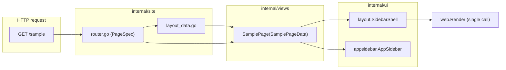
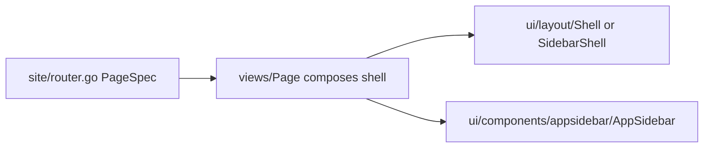

# Blank Next/shadcn Architecture

Durable architecture spec for the Blank refactor aimed at React developers who know **Next App Router** and **shadcn/ui**. This document freezes vocabulary and responsibilities.

**Status:** Page-composes-layout refactor complete — see [page-composes-layout.md](./page-composes-layout.md).
**Previous status:** Blocks 00–11 (named-shell adapters) — superseded; snapshot at [archive/block-11-final.md](./archive/block-11-final.md).

---

## Intent

Blank is a **server-rendered BFF frontend** (Go + templ + Tailwind). React developers should onboard using the same mental model as Next + shadcn:

```text
route -> page (composes its own layout shell) -> content
```

The **page template file is the single point of truth** for the layout tree. Opening `internal/views/sample_stub.templ` shows `SidebarShell + AppSidebar + content` in one place — the same cognitive experience as opening `app/dashboard/page.tsx` in a shadcn project.

---

## Glossary

| Term | Blank location | Role |
|------|----------------|------|
| **Document shell** | `internal/ui/layout/shell.templ` → `layout.Shell` | Full HTML document: `DOCTYPE`, `html`, `head`, `body`, asset hooks, header, footer, mobile sheet, `@ui8kit/aria` markup hooks. The topnav variant. |
| **Sidebar shell** | `internal/ui/layout/sidebar_shell.templ` → `layout.SidebarShell` | `Shell` plus a desktop aside slot beside the main column. Analogous to shadcn `SidebarProvider + SidebarInset`. |
| **Local aside** | `internal/ui/components/appsidebar/` → `appsidebar.AppSidebar` | Project-owned aside content (title + vertical nav). Analogous to shadcn `components/app-sidebar.tsx`. Copy-paste-friendly. |
| **Page** | `internal/views/*.templ` (e.g. `HomePage`, `SamplePage`) | **Composes** its own layout shell at the top of the templ + content body. Receives resolved props/strings. No fixture loading inside `.templ`. Analogous to `page.tsx`. |
| **Page data** | `internal/views/models.go` (e.g. `HomePageData`, `SamplePageData`) | View-model with `Shell layout.ShellProps` (and `Sidebar appsidebar.Props` if relevant) plus content fields. |
| **Registry artifact** | `internal/ui/{components,blocks,widgets,variants,utils}` | Copy-pasteable or reusable UI mass accumulated in the app registry before extraction. |
| **Block** | `internal/ui/blocks/<domain>/*` | **Full scaffolds** — complete sections or pre-built dashboards with default copy. **Not** empty adapter wrappers. |

### Two confusing terms (resolved)

Earlier iterations had a **route shell** layer (`views.AppShell`, `views.SidebarAppShell`, …) as runtime adapters. That layer is **removed** — pages compose their shell directly. There is now one "shell" concept: the named document shells in `internal/ui/layout/`.

---

## Next / shadcn mapping

| Next App Router | shadcn | Blank |
|-----------------|--------|-------|
| `next.config.ts` / `vite.config.ts` | — | [`fastygo.config.mjs`](../../fastygo.config.mjs) — **tooling only** |
| Root `app/layout.tsx` document frame | — | `internal/ui/layout/shell.templ` (Shell) |
| `SidebarProvider + SidebarInset` | shadcn sidebar primitives | `internal/ui/layout/sidebar_shell.templ` (SidebarShell) |
| `components/app-sidebar.tsx` | local aside content | `internal/ui/components/appsidebar/` |
| `app/(app)/layout.tsx`, `(marketing)/layout.tsx`, `(docs)/layout.tsx` | route group adapters | **inline** in `internal/views/<page>.templ` — page chooses which `@layout.*` to compose |
| `app/**/page.tsx` | block content | `internal/views/<page>.templ` (composes shell + content) |
| `components/ui/*` | primitives | `github.com/fastygo/templ/ui` + `templ/components` |
| App components | local UI | `internal/ui/components/*` |
| shadcn blocks (full scaffolds) | copy-paste | `internal/ui/blocks/*` (full scaffolds only) |
| Route table | file-based routes | `internal/site/router.go` (`PageSpec`) |
| `middleware.ts` | — | `internal/serverapp/app.go` (locales, security) |
| `messages/*.json` | — | `internal/fixtures/locale/*.json` |

---

## Request flow



**Onboarding rule:** React devs touch **`internal/views/*.templ`** and **`internal/fixtures/locale/*.json`** daily; **`internal/site/`** stays thin runtime routing; named shells and components live in **`internal/ui/*`**.

---

## Registry boundary

Three concepts must stay separate:

| Concept | Location | shadcn analogy |
|---------|----------|----------------|
| **Runtime wiring** | `internal/site/router.go` (`PageSpec`) | Route table — Title, Body, Nav (no Layout field) |
| **Page composition** | `internal/views/<page>.templ` | `page.tsx` — composes shell + content |
| **Registry artifact** | `internal/ui/{layout,components,blocks,widgets,…}` | Named shells, local components, full scaffolds, behavior widgets |



**Rule:** Do not put reusable layout organisms in `internal/site/`, do not reintroduce empty `views/*Shell` adapter functions, do not create empty `blocks/*` wrappers around `layout.Shell`.

### Where named shells live

`internal/ui/layout/` hosts the **named document shells** composed by pages directly:

| Shell | Composition | Used by |
|-------|-------------|---------|
| `layout.Shell` | topnav: `html + head + body + Header + main{children} + Footer` | `views.HomePage` |
| `layout.SidebarShell` | `Shell` + `flex row (aside slot + main{children})` | `views.SamplePage` |

Add new shells in `layout/` only when a route needs **structurally different document chrome**. Geometry variants that fork from `SidebarShell` (alternate grids, dual aside) belong as **full scaffolds** in `blocks/<domain>/<organism>/`, not as empty adapter wrappers.

### Where full scaffolds live

`internal/ui/blocks/<domain>/<organism>/` for **complete artifacts** with in-package default data — shadcn-style copy-paste blocks (full hero, dashboard, docs toc):

| Domain folder | Example organism | Use |
|---------------|------------------|-----|
| `blocks/dashboard/` | (currently empty — stub) | Future dashboard scaffolds |
| `blocks/docs/` | `toc_shell` | Docs toc + content column |
| `blocks/marketing/` | `topnav_shell`, `landing_shell` | Public/landing layouts |

**Do not** create `internal/ui/blocks/layout/` (collides with `internal/ui/layout/`).
**Do not** create `internal/ui/recipes`, `internal/ui/elements`, `internal/ui/ui/`.
**Do not** create empty `blocks/*` packages whose only job is `@layout.Shell { @body }`.

### What stays in `internal/ui/layout/` permanently

- `Shell`, `SidebarShell`, and any future named document shells
- Header, footer, navigation host markup
- Props/helpers shared by all routes

### components vs blocks vs widgets

| Layer | When to use | Example |
|-------|-------------|---------|
| **`components/`** | Small props-only app UI; aside content for shells | `icon/`, `toggles/`, `navigation/`, `appsidebar/` |
| **`blocks/<domain>/`** | Full scaffolds with default copy | `docs/toc_shell` (future), `marketing/landing_shell` (future) |
| **`widgets/`** | UI + fetch/state/orchestration | Live data shell, authenticated nav |

---

## Public naming (frozen)

| Symbol | Status | Meaning |
|--------|--------|---------|
| `layout.Shell` | **Keep** | Topnav document shell composed by pages. |
| `layout.SidebarShell` | **Keep** | Sidebar document shell composed by pages; takes `(shell ShellProps, sidebar templ.Component)`. |
| `appsidebar.AppSidebar` | **Keep** | Local aside; populates `SidebarShell`'s sidebar slot. Forkable. |
| `views.ShellPropsFor(d)` | **Keep** | Builds `layout.ShellProps` from `views.LayoutData`. |
| `views.SidebarPropsFor(d, title)` | **Keep** | Builds `appsidebar.Props` from `views.LayoutData`. |
| `views.AppShell` / `views.SidebarAppShell` / `views.MarketingShell` / `views.DocsShell` | **Removed** | Route adapters; replaced by direct shell composition in page templates. |
| `PageSpec.Layout` | **Removed** | Layout choice lives inside the page templ, not the route spec. |

---

## Layer responsibilities

### `internal/site/`

- HTTP route registration
- Locale resolution per request
- Building `views.LayoutData` from fixtures
- Forwarding to page renderer (`PageSpec.Body`)
- **Must not** contain page markup or layout selection

### `internal/views/`

- Page templates (`*Page`) that compose their layout shell + content
- View models (`models.go`) with `Shell layout.ShellProps` and optional `Sidebar appsidebar.Props`
- Helpers (`layout_helpers.go`) that map `LayoutData` to shell/sidebar props
- **Must not** load fixtures inside `.templ`
- **Must not** define adapter functions (`*Shell`) that only forward props

### `internal/ui/*`

- `layout/`: named document shells composed by pages (`Shell`, `SidebarShell`); stays in app
- `components/`: small props-only app UI; includes `appsidebar/` for the sidebar slot
- `blocks/<domain>/`: full scaffolds with default demo data — **not** empty adapter wrappers
- `widgets/`: reusable UI with behavior/data orchestration
- `variants/` and `utils/`: named class maps and thin helpers
- Preserves `data-ui8kit-*` / `@ui8kit/aria` contracts where behavior is needed

### `internal/fixtures/`

- Embedded locale JSON + typed `Locale`
- User-visible copy including ARIA labels for chrome

### `fastygo.config.mjs`

- Dev/build tooling: server env, templ, CSS, JS bundles, ui8px validation
- **Not** the route registry, **not** layout selection

---

## Interaction policy (no custom JS)

- Covered patterns use **`@ui8kit/aria`** via committed `web/static/js/ui8kit.js` and [`manifest.json`](../../web/static/js/manifest.json).
- Mobile navigation/sheets use existing **dialog/sheet** hooks (`data-ui8kit`, `data-ui8kit-dialog-*`) or `templ/components` Sheet with `Behavior: "ui8kit"`.
- **`theme.js`** is allowed for theme toggle (existing app behavior).
- Do **not** add custom client state for sidebar collapse, cookie persistence, or keyboard shortcuts until a spec explicitly requires it and `@ui8kit/aria` does not cover the pattern.
- New manifest patterns require **`bun run build:js`** and **`bun run validate:aria`**.

---

## Non-goals

| Item | Reason |
|------|--------|
| Reintroducing `views.*Shell` route adapters | Pages compose shells directly — that is the win. |
| `PageSpec.Layout` field | Was a misleading declarative perk — the layout was not visible from the page. |
| Empty `blocks/*` adapter wrappers | Indirection without scaffold content; absorbed into `layout/`. |
| `routes.yaml` + codegen | Later DX layer; Go route manifest first. |
| Custom JS for sidebar/sheet | Use `@ui8kit/aria` + templ Sheet. |
| Icon-collapse sidebar + cookie state | shadcn parity deferred; wireframe phase. |
| Full layout engine / JSON layout config | Pages compose shells explicitly. |
| Split `site` / `app` / `docs` features | Only when multiple layout groups need different nav. |
| `github.com/fastygo/blocks` / `widgets` deps | Staging stays in `internal/ui/*`. |
| Go auto-restart in dev | Document honest restart-after-Go-change workflow. |

---

## Sidebar direction (summary)

Sidebars are **named shells + local components**, not separate repos or branches:

- **Shell:** `layout.SidebarShell` (topnav + desktop aside slot + main column)
- **Local aside:** `appsidebar.AppSidebar` (forkable per project)
- **Desktop:** static `aside` rendered by `appsidebar.AppSidebar` in the shell's sidebar slot
- **Mobile:** same nav content in `navigation.MobileSheet` + `MobileSheetTrigger` (inherited from `Shell`)
- **Geometry variants:** represented by **forking** `SidebarShell` or `AppSidebar`, not by a global runtime engine

---

## One-line onboarding

> **Routes live in `internal/site/router.go`. Pages live in `internal/views/<page>.templ` and compose their own layout shell — `@layout.Shell { ... }` or `@layout.SidebarShell(shell, appsidebar.AppSidebar(s)) { ... }`. Named shells live in `internal/ui/layout/`. Aside content lives in `internal/ui/components/appsidebar/`. Copy lives in `internal/fixtures/locale/*.json`.**

---

## Refactor history

| Track | Status | Reference |
|-------|--------|-----------|
| Blocks 00–11 (named route adapters) | Completed, **superseded** | [`archive/block-11-final.md`](./archive/block-11-final.md) |
| Page composes layout (no adapters) | **Active** | [`page-composes-layout.md`](./page-composes-layout.md) |
