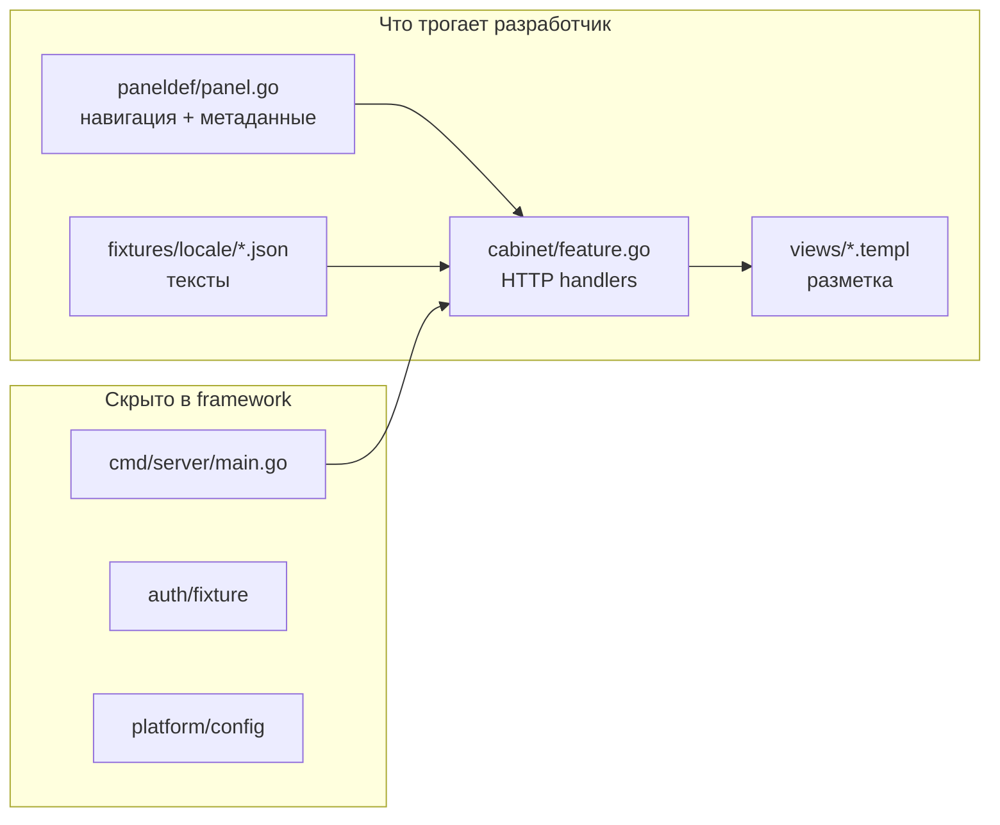

Ниже — как устроен **Blank** сейчас, куда он «ломается» для Vite/Express-разработчика, и как его можно переупаковать в **Vite-like онбординг** с адаптерами данных.

---

## Как устроен Blank сегодня

Blank — не «сайт на Vite», а **Go-сервер + templ + UI8Kit shell** для личного кабинета.



**Стек:**

| Слой | Пакет | Роль |
|------|--------|------|
| Bootstrap | `framework/pkg/app` | конфиг, mux, locale, static, health |
| Control plane | `panel` | страницы, nav, будущие CRUD-ресурсы |
| UI shell | `ui8kit/layout` | sidebar, header, theme, sheet |
| Atoms | `ui8kit/ui` | Stack, Title, Button… |
| App | `internal/cabinet` | маршруты + glue |
| Copy | `fixtures` | embedded JSON по локалям |

**Новая страница сейчас = 3–4 места:**

1. `paneldef/panel.go` — пункт меню и path  
2. `cabinet/feature.go` — `mux.HandleFunc` + загрузка данных  
3. `views/*.templ` — UI  
4. `fixtures/locale/*.json` (+ часто `fixtures.go` struct) — строки  

Для Go-разработчика это нормально. Для человека с Express/Vite — «почему route в двух файлах и ещё JSON со struct в Go?».

---

## Маппинг на привычный стек

| Привычное | Аналог в Blank / целевой модели |
|-----------|--------------------------------|
| `npm create vite` | `fastygo create` или clone Blank |
| `vite.config.ts` | **`app.config.yaml`** (port, locales, theme, data driver) |
| `src/pages/about.tsx` | **`pages/about.templ`** |
| `src/App.tsx` layout | **`layouts/app.templ`** (обёртка над `CabinetLayout` / marketing shell) |
| `tailwind.config` + `@source` | уже есть: `web/static/css/input.css` |
| `npm run dev` | **`bun run dev`** = css watch + templ watch + server |
| Express `app.get('/blog', …)` | **`routes.yaml`** или тонкий `routes.go` |
| `res.render('blog', { posts })` | `web.Render(ctx, w, pages.Blog(posts))` |
| Prisma / mock JSON | **`data` adapter** (fixtures → sqlite → markdown) |

Ключевая идея: **разработчик живёт в `pages/`, `routes`, `data/`, `locales/`** — не в `paneldef` + ручном mux.

---

## Целевая структура (Vite-like)

```
my-site/
  app.config.yaml          # порт, brand, locales, DATA_DRIVER=fixtures
  routes.yaml              # декларативные маршруты (как Express router table)
  pages/                   # как src/pages — только UI
    home.templ
    blog/
      index.templ
      [slug].templ         # позже: codegen или convention
  layouts/
    default.templ          # shell один раз
  data/                    # источник правды для fixtures/markdown
    blog/
      posts.json
    pages/
      about.md
  locales/
    en.json
    ru.json
  public/                  # → web/static (картинки, favicon)
  web/static/css/
    input.css              # @source на pages/** и ui/**
```

**Что скрыто (как Vite скрывает Rollup/esbuild):**

- `cmd/server/main.go` — composition root, не трогаем  
- `internal/platform` — env → config  
- codegen: `routes.yaml` → handlers / nav  
- `go tool templ generate` — в `dev`/`build`, не в README  

---

## Маршруты: Express-стиль без Go в голове

**`routes.yaml`** (концепт):

```yaml
layout: default

routes:
  - path: /
    page: home
    title: Home

  - path: /blog
    page: blog/index
    data: blog.posts          # adapter query id

  - path: /blog/:slug
    page: blog/show
    data: blog.post           # param: slug
```

CLI (`fastygo routes sync`) генерирует:

- записи в nav (если `nav: true`)  
- `HandleFunc` в одном `routes_gen.go`  
- связку `data.Query("blog.posts")` → view props  

**Hand-written handler** остаётся только для форм POST, auth, нестандартной логики — как в Express middleware.

---

## Data adapter: одна точка входа

Panel уже задаёт контракт (`DataSource`, `RecordProvider`) — его можно **упростить для сайтов**:

```go
// То, что видит автор страницы (concept)
posts, err := data.List(ctx, "blog.posts")
post,  err := data.Get(ctx, "blog.post", data.Param("slug", slug))
```

**Конфиг:**

```yaml
# app.config.yaml
data:
  driver: fixtures    # fixtures | sqlite | markdown
  root: ./data
```

| Driver | Когда | Откуда данные |
|--------|--------|----------------|
| `fixtures` | прототип, статика | `data/**/*.json` |
| `markdown` | блог, docs | `data/**/*.md` + frontmatter |
| `sqlite` | простой CMS/CRM | `./app.db`, миграции позже |

Пользователь **не импортирует** `database/sql`. Меняет одну строку в config — как `DATABASE_URL` в Node, но без ORM в онбординге.

Для cabinet/CRUD позже тот же adapter реализует `panel.DataSource` — Blank уже на Panel заточен.

---

## Онбординг для JS-разработчика (5 минут)

### 1. Создание

```bash
fastygo create my-site --template site   # или cabinet
cd my-site
bun install
bun run dev
```

Открывает `http://127.0.0.1:8080`. Одна команда: Tailwind watch + templ watch + Go server (аналог `vite dev`).

### 2. Первая страница

**`pages/about.templ`:**

```templ
templ About(props AboutProps) {
  @ui.Stack(...) {
    @ui.Title(..., props.Title)
    @ui.Text(..., props.Body)
  }
}
```

**`routes.yaml`:**

```yaml
- path: /about
  page: about
  title: About
```

**`locales/en.json`:**

```json
{ "about": { "title": "About us", "body": "..." } }
```

`bun run dev` — страница и пункт меню появляются сами (через codegen).

### 3. Данные

**`data/blog/posts.json`:**

```json
[{ "slug": "hello", "title": "Hello" }]
```

**`pages/blog/index.templ`** получает `props.Posts` — handler генерируется из `data: blog.posts`.

Смена на SQLite: `data.driver: sqlite` в config, JSON остаётся для seed/тестов.

### 4. UI из FastyGoUI / registry

```bash
fastygo add marketing-hero
fastygo add button
```

Копирует block + deps в `internal/ui/blocks/` (как shadcn). В странице:

```templ
@blocks.MarketingHero(blocks.MarketingHeroDefault())
```

Разработчик думает «компонент из registry», не «vendor github.com/fastygo/templ/ui».

---

## Что упростить в самом Blank

Сейчас дублирование **paneldef ↔ feature ↔ locale struct**:

| Сейчас | Vite-like |
|--------|-----------|
| `panel.Page{ Path, Navigation... }` + `HandleFunc` с тем же path | один `routes.yaml` |
| `fixtures.Locale` struct на каждый ключ | `locales/*.json` + codegen или `map[string]any` для простых сайтов |
| README: 5 команд (`templ`, `css`, `go mod`, env…) | **`bun run dev`** и **`bun run build`** |
| Auth fixture в Go | для **site** template — без auth; для **cabinet** — скрытый fixture + позже adapter |

**Два шаблона из одной базы:**

| Template | Auth | Типичный use |
|----------|------|--------------|
| `site` | нет | landing, blog, docs |
| `cabinet` | fixture login | Blank как сейчас |

---

## Dev UX (как у Vite)

```json
{
  "dev": "concurrently \"tailwindcss --watch\" \"templ generate --watch\" \"go run ./cmd/server\"",
  "build": "templ generate && tailwindcss --minify && go build -o bin/app ./cmd/server"
}
```

Плюс:

- **понятные ошибки**: «page `blog/index` not found», «data query `blog.posts` missing file»  
- **preview deploy**: статика как у FastyGoUI docs (Vercel без Go) для `site` template  
- **docs onboarding**: «Express route → routes.yaml», «React page → pages/*.templ»

---

## Что остаётся «Go под капотом» (и это ок)

- Серверный рендер (templ) — как SSR без React runtime  
- Типы view props — как TypeScript interfaces, но в Go  
- `go test` для критичных страниц — опционально в онбординге  

Не учить: modules, `Feature interface`, embed FS, panel generics — это framework layer.

---

## Практический roadmap (по приоритету)

1. **`bun run dev`** — один entrypoint (watch всего)  
2. **`routes.yaml` + codegen** — убрать ручной mux для 80% страниц  
3. **`data` package** — `fixtures` driver из `data/**/*.json`  
4. **`app.config.yaml`** — locales, brand, driver (вместо разрозненных env)  
5. **`site` vs `cabinet` template** — Blank = cabinet, новый clone = site  
6. **`fastygo add`** — связка с FastyGoUI registry  
7. **markdown driver** — блог/docs без БД  

---

## Резюме

**Blank сейчас** — правильный **composition root** (framework + panel + ui8kit + fixtures), но онбординг заточен под Go: три файла на страницу и typed fixtures.

**Vite-like слой** — не переписывать Go, а добавить **конвенции + codegen + один dev script**:

- страницы в `pages/*.templ`  
- маршруты в `routes.yaml`  
- данные через `data.List/Get` с переключаемым driver  
- Tailwind уже на месте  
- UI из registry одной командой  

Программист с Express/Vite работает в **файловой структуре и YAML**, как привык; Go, templ generate и panel остаются инфраструктурой — как esbuild внутри Vite.

Если нужно, в Agent mode могу набросать конкретный `routes.yaml` + минимальный codegen поверх текущего `cabinet/feature.go`, или отдельный `site`-шаблон без auth.