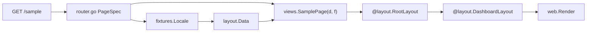
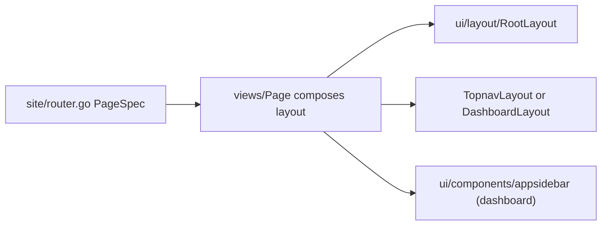

# Blank architecture

Durable architecture reference for Blank — a **server-rendered BFF frontend** (Go + templ + Tailwind). Vocabulary and boundaries are aligned with **Next App Router** and **shadcn/ui** so React developers can onboard quickly.

For onboarding and day-to-day workflow, start with [`for-react-devs.md`](./for-react-devs.md).

---

## Intent

```text
route -> PageSpec -> views.<Page>(d, f) -> RootLayout + TopnavLayout|DashboardLayout -> content
```

The **page template file is the single point of truth** for the layout tree. Opening `internal/views/sample.templ` shows `RootLayout + DashboardLayout + content` in one place — the same cognitive experience as opening `app/dashboard/page.tsx` in a shadcn project.

There is **no** `PageSpec.Layout` field and **no** route adapter layer (`views.*Shell`). Layout choice is explicit in each page `.templ`.

---

## Glossary

| Term | Blank location | Role |
|------|----------------|------|
| **Root layout** | `internal/ui/layout/root_layout.templ` → `layout.RootLayout` | Document frame only: `html`, `head`, `body`, asset hooks |
| **Topnav layout** | `internal/ui/layout/topnav_layout.templ` → `layout.TopnavLayout` | Header, main slot, footer, mobile sheet |
| **Dashboard layout** | `internal/ui/layout/dashboard_layout.templ` → `layout.DashboardLayout` | `TopnavLayout` + desktop aside column |
| **Local aside** | `internal/ui/components/appsidebar/` → `appsidebar.AppSidebar` | Project-owned aside content (title + vertical nav) |
| **Page** | `internal/views/*.templ` | Composes layout layers + content; receives `layout.Data` + `fixtures.Locale` |
| **Layout request data** | `internal/ui/layout/data.go` → `layout.Data` | Per-request shell inputs; `Document()`, `Topnav()`, `Dashboard(title)` |
| **Registry artifact** | `internal/ui/{components,blocks,widgets,variants,utils}` | Reusable UI mass staged in the app before extraction |
| **Block** | `internal/ui/blocks/<domain>/*` | **Full scaffolds** — complete sections with default copy; not adapter wrappers |

---

## Next / shadcn mapping

| Next App Router | shadcn | Blank |
|-----------------|--------|-------|
| `vite.config.ts` | — | [`fastygo.config.mjs`](../fastygo.config.mjs) — **tooling only** |
| Root `app/layout.tsx` | — | `layout.RootLayout` |
| `app/(marketing)/layout.tsx` | route group chrome | `layout.TopnavLayout` |
| `SidebarProvider + SidebarInset` | sidebar primitives | `layout.DashboardLayout` |
| `components/app-sidebar.tsx` | local aside | `internal/ui/components/appsidebar/` |
| `app/**/page.tsx` | page content | `internal/views/<page>.templ` |
| `components/ui/*` | primitives | `github.com/fastygo/templ/ui` + `templ/components` |
| App components | local UI | `internal/ui/components/*` |
| shadcn blocks | copy-paste scaffolds | `internal/ui/blocks/*` |
| Route table | file-based routes | `internal/site/router.go` (`PageSpec`) |
| `middleware.ts` | — | `internal/serverapp/app.go` |
| `messages/*.json` | — | `internal/fixtures/locale/*.json` |

---

## Request flow



**Onboarding rule:** touch **`internal/views/*.templ`** and **`internal/fixtures/locale/*.json`** daily; **`internal/site/`** stays thin; named layouts and components live in **`internal/ui/*`**.

---

## Registry boundary

Three concepts must stay separate:

| Concept | Location | shadcn analogy |
|---------|----------|----------------|
| **Runtime wiring** | `internal/site/router.go` (`PageSpec`) | Route table — Title, Body, Nav |
| **Page composition** | `internal/views/<page>.templ` | `page.tsx` — composes layout + content |
| **Registry artifact** | `internal/ui/{layout,components,blocks,widgets,…}` | Layout layers, local components, full scaffolds |



**Rules:**

- Do not put reusable layout organisms in `internal/site/`.
- Do not reintroduce empty `views/*Shell` adapter functions.
- Do not create empty `blocks/*` packages whose only job is wrapping a layout layer.

### Layout layers (`internal/ui/layout/`)

| Layer | Composition | Used by |
|-------|-------------|---------|
| `layout.RootLayout` | `html + head + body{children}` | Every page |
| `layout.TopnavLayout` | header + main + footer + mobile sheet | `views.HomePage` |
| `layout.DashboardLayout` | `TopnavLayout` + aside + main column | `views.SamplePage` |

Add new layout layers only when a route needs **structurally different document chrome**. Geometry variants that fork from `DashboardLayout` belong as **full scaffolds** in `blocks/<domain>/<organism>/`, not as empty adapters.

### Full scaffolds (`internal/ui/blocks/`)

`blocks/<domain>/<organism>/` for **complete artifacts** with in-package default data:

| Domain folder | Example | Use |
|---------------|---------|-----|
| `blocks/marketing/` | `hero/` | Landing hero section |
| `blocks/docs/` | (future) | Docs toc + content column |
| `blocks/dashboard/` | (stub) | Future dashboard scaffolds |

**Do not** create `internal/ui/blocks/layout/` (collides with `internal/ui/layout/`).

### components vs blocks vs widgets

| Layer | When to use | Example |
|-------|-------------|---------|
| **`components/`** | Small props-only app UI; aside content | `icon/`, `navigation/`, `appsidebar/` |
| **`blocks/<domain>/`** | Full scaffolds with default copy | `marketing/hero/` |
| **`widgets/`** | UI + fetch/state/orchestration | Live data shell, authenticated nav |

---

## Layer responsibilities

### `internal/site/`

- HTTP route registration
- Locale resolution per request
- Building `layout.Data` via `layout.BuildData`
- Forwarding to page renderer (`PageSpec.Body`)
- **Must not** contain page markup or layout selection

### `internal/views/`

- Page templates (`*Page`) that compose layout layers + content
- Signature: `views.<Page>(d layout.Data, f fixtures.Locale)`
- **Must not** load fixtures inside `.templ`

### `internal/ui/*`

- `layout/` — document and chrome layers composed by pages
- `components/` — small props-only app UI; includes `appsidebar/`
- `blocks/<domain>/` — full scaffolds with default demo data
- `widgets/` — reusable UI with behavior/data orchestration
- `variants/` and `utils/` — named class maps and thin helpers
- Preserves `data-ui8kit-*` / `@ui8kit/aria` contracts where behavior is needed

### `internal/fixtures/`

- Embedded locale JSON + typed `Locale`
- User-visible copy including ARIA labels for chrome

### `fastygo.config.mjs`

- Dev/build tooling: server env, templ, CSS, JS bundles, ui8px validation
- **Not** the route registry, **not** layout selection

---

## Interaction policy (no custom JS)

- Covered patterns use **`@ui8kit/aria`** via `web/static/js/ui8kit.js` and [`manifest.json`](../web/static/js/manifest.json).
- Mobile navigation/sheets use dialog/sheet hooks (`data-ui8kit`, `data-ui8kit-dialog-*`) or `templ/components` Sheet with `Behavior: "ui8kit"`.
- **`theme.js`** is allowed for theme toggle.
- Do **not** add custom client state for sidebar collapse, cookie persistence, or keyboard shortcuts until a spec explicitly requires it and `@ui8kit/aria` does not cover the pattern.
- New manifest patterns require **`bun run build:js`** and **`bun run validate:aria`**.

---

## Non-goals

| Item | Reason |
|------|--------|
| `views.*Shell` route adapters | Pages compose layouts directly |
| `PageSpec.Layout` field | Layout must be visible from the page file |
| Empty `blocks/*` adapter wrappers | Indirection without scaffold content |
| `routes.yaml` + codegen | Later DX layer; Go route manifest first |
| Custom JS for sidebar/sheet | Use `@ui8kit/aria` + templ Sheet |
| Icon-collapse sidebar + cookie state | shadcn parity deferred; wireframe phase |
| Full layout engine / JSON layout config | Pages compose layouts explicitly |
| `github.com/fastygo/blocks` / `widgets` deps during staging | Staging stays in `internal/ui/*` |
| Go auto-restart in dev | Document honest restart-after-Go-change workflow |

---

## Maintainer checklist (add a page)

1. Add route copy to [`internal/fixtures/fixtures.go`](../internal/fixtures/fixtures.go) and **every** [`internal/fixtures/locale/*.json`](../internal/fixtures/locale/) file.
2. Add `internal/views/<page>.templ` — `templ <Page>(d layout.Data, f fixtures.Locale)` composing `@layout.RootLayout` + `@layout.TopnavLayout` or `@layout.DashboardLayout`.
3. Add one [`PageSpec`](../internal/site/router.go) with `Body: views.<Page>`.
4. Run **`bun run verify`**.

Layout request data: [`internal/ui/layout/data.go`](../internal/ui/layout/data.go) (`layout.Data`, `Document()`, `Topnav()`, `Dashboard(title)`).

---

## One-line onboarding

> **Routes live in `internal/site/router.go`. Pages live in `internal/views/<page>.templ` and compose `@layout.RootLayout` + `@layout.TopnavLayout` or `@layout.DashboardLayout`. Chrome lives in `internal/ui/layout/`. Aside content lives in `internal/ui/components/appsidebar/`. Copy lives in `internal/fixtures/locale/*.json`.**

---

## Related docs

| File | Role |
|------|------|
| [`for-react-devs.md`](./for-react-devs.md) | Onboarding, cookbook, dev loop |
| [`internal/ui/README.md`](../internal/ui/README.md) | Registry tree and promotion |
| [`internal/ui/layout/README.md`](../internal/ui/layout/README.md) | Layout layer details |
