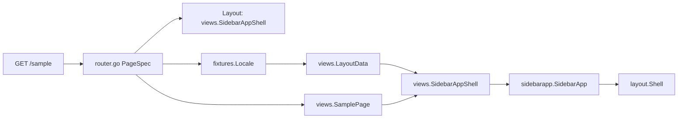

# Blank for React developers

Blank is a **server-rendered BFF frontend**: HTML is composed on the Go server with [templ](https://templ.guide/), styled with Tailwind, and served with static assets under `/static/`. It is not a client-side SPA, but the dev workflow is intentionally close to **Vite + SSR**.

If you know **Next App Router** and **shadcn/ui**, start here — you do not need to read framework internals to add a page.

## One-line mental model

```text
route -> PageSpec -> layout data -> route shell -> page body
```

Runtime routes live in [`internal/site/router.go`](../internal/site/router.go). Pages live in [`internal/views/`](../internal/views/). **Choose the route shell in one `PageSpec.Layout` line** — e.g. `views.AppShell`, `views.SidebarAppShell`, `views.MarketingShell`, or `views.DocsShell`. Reusable UI artifacts live in [`internal/ui/`](../internal/ui/). Copy lives in [`internal/fixtures/locale/`](../internal/fixtures/locale/).

## File map

| Next / React + shadcn | Blank | Role |
|-----------------------|-------|------|
| `app/layout.tsx` (document frame) | [`internal/ui/layout/shell.templ`](../internal/ui/layout/shell.templ) → `layout.Shell` | **Document / chrome shell** — `html`, `head`, `body`, header, footer, mobile sheet, assets |
| `app/(app)/layout.tsx` | [`internal/views/layout.templ`](../internal/views/layout.templ) → `views.AppShell` | **Route shell** — topnav app zone (`/` today) |
| Sidebar app route shell | `views.SidebarAppShell` → [`sidebar_app`](../internal/ui/blocks/dashboard/sidebar_app/) block | **Route shell** — desktop aside + mobile sheet (`/sample` today) |
| `app/(marketing)/layout.tsx` | `views.MarketingShell` | Route shell — landing/marketing (currently same chrome as `AppShell`) |
| `app/(docs)/layout.tsx` | `views.DocsShell` | Route shell — docs (placeholder until docs routes) |
| `app/**/page.tsx` | [`internal/views/*.templ`](../internal/views/) | Page content only |
| `components/ui/*` | [`github.com/fastygo/templ/ui`](https://github.com/fastygo/templ) + [`templ/components`](https://github.com/fastygo/templ) + [`internal/ui/*`](../internal/ui/) | Atoms/molecules from templ; app registry for blocks, components, widgets |
| `vite.config.ts` | [`fastygo.config.mjs`](../fastygo.config.mjs) | **Tooling only** — server env, templ generate paths, CSS/JS build, ui8px validation. Not the route registry. |
| `messages/*.json` | [`internal/fixtures/locale/*.json`](../internal/fixtures/locale/) | Site copy per locale |
| Dev overlay i18n | [`internal/devoverlay/fixtures/locale/`](../internal/devoverlay/fixtures/locale/) | Separate from site fixtures |

## Request flow

When docs say “layout”, check which layer is meant. Blank uses **two layout layers**:

1. **Route shell** (`views.AppShell`, `views.SidebarAppShell`, …) — analogous to Next route-group `layout.tsx`; chosen in `PageSpec.Layout`.
2. **Document shell** (`layout.Shell`) — analogous to root document frame only.

Example for `GET /sample` (sidebar app shell):

```text
GET /sample
  -> PageSpec in internal/site/router.go (Layout: views.SidebarAppShell)
  -> fixtures.Locale (en/ru)
  -> views.LayoutData (nav, theme, language switch, assets)
  -> views.SidebarAppShell(data, SamplePage(...))
       -> sidebarapp.SidebarApp (registry block)
            -> layout.Shell (document chrome)
  -> web.Render (full HTML response)
```

Example for `GET /` (topnav app shell):

```text
GET /
  -> PageSpec (Layout: views.AppShell)
  -> views.AppShell(data, HomePage(...))
       -> appshell.AppShell -> layout.Shell
```



**Naming:** Prefer `views.AppShell` in new code. `views.SiteShell` is a **temporary alias** to `AppShell` for backward compatibility.

Architecture details: [`.project/specs/next-shadcn-architecture.md`](../.project/specs/next-shadcn-architecture.md).

## Runtime site package

| File | Role |
|------|------|
| [`internal/site/router.go`](../internal/site/router.go) | Route manifest — `PageSpec` entries with visible `Layout`, `Title`, `Body`, `Nav` |
| [`internal/site/render.go`](../internal/site/render.go) | `handlePage` — locale, layout data, `web.Render` |
| [`internal/site/nav.go`](../internal/site/nav.go) | Header nav derived from `PageSpec.Nav` |
| [`internal/site/layout_data.go`](../internal/site/layout_data.go) | Assets, navigation props, language switch |
| [`internal/site/feature.go`](../internal/site/feature.go) | Feature wiring — registers routes from the manifest |

There is **no** `routes.yaml` or codegen yet. Adding a route means editing Go in `router.go`.

## Registry terms (shadcn-like)

Blank separates **runtime wiring** from **copy-pasteable UI artifacts**:

| Term | Location | shadcn analogy |
|------|----------|----------------|
| **Document / chrome shell** | `internal/ui/layout/*` | App-owned frame (header, footer, mobile sheet host) |
| **Route shell** | `views.AppShell`, `views.SidebarAppShell`, `MarketingShell`, `DocsShell` | Runtime adapter — one line in `PageSpec.Layout`; wraps registry blocks |
| **Page** | `internal/views/*.templ` | `page.tsx` content only |
| **Components** | `internal/ui/components/*` | Small reusable UI; props in, markup out |
| **Blocks** | `internal/ui/blocks/*` | Layout organisms and sections (`app_shell`, `sidebar_app`, …) |
| **Widgets** | `internal/ui/widgets/*` | UI + behavior (fetch, state, orchestration) |

Kit primitives (`Button`, `Stack`, `Card`, `Sheet`, …) come from **`github.com/fastygo/templ`**. App-specific reusable mass accumulates under **`internal/ui/*`** until extraction.

See [`internal/ui/README.md`](../internal/ui/README.md) for the registry tree.

## Adding a page (cookbook)

Follow the existing `/sample` route as a template.

### 1. Add copy to fixtures

Extend [`fixtures.Locale`](../internal/fixtures/fixtures.go) with a new struct (e.g. `About`) and add matching keys to **every** file in [`internal/fixtures/locale/`](../internal/fixtures/locale/) (`en.json`, `ru.json`, …).

### 2. Create the page template

Add `internal/views/about.templ` (content only — no header, footer, or nav):

```templ
templ AboutPage(data AboutData) {
    @ui.Box(...) { ... }
}
```

Add props to [`internal/views/models.go`](../internal/views/models.go) if needed.

### 3. Register one route spec

Add one entry to `pages` in [`internal/site/router.go`](../internal/site/router.go):

```go
{
    Method:  "GET",
    Pattern: "/about",
    Active:  "/about",
    Layout:  views.AppShell, // or SidebarAppShell / MarketingShell / DocsShell
    Title:   func(f fixtures.Locale) string { return f.About.Title },
    Body: func(f fixtures.Locale) templ.Component {
        return views.AboutPage(views.AboutData{ ... })
    },
    Nav: func(f fixtures.Locale) (layout.NavItem, bool) {
        return layout.NavItem{Label: f.About.NavLabel, Path: "/about", Icon: "info"}, true
    },
},
```

Nav is optional: omit `Nav` or return `false` for routes that should not appear in the header.

### 4. Rebuild and verify

```bash
bun run templ          # after .templ changes
go test ./...          # optional but recommended
bun run dev            # restart if Go files changed
```

Refresh the browser (F5). There is no in-browser HMR for SSR HTML.

## Client interactivity

Use [`@ui8kit/aria`](../web/static/js/ui8kit.js) + `data-ui8kit` hooks for covered W3C patterns (dialog, sheet, tabs, …). Do not add custom JS for patterns already in the manifest ([`web/static/js/manifest.json`](../web/static/js/manifest.json)).

After changing markup hooks or bundle composition: `bun run build:js` then `bun run validate:aria`.

## Dev loop (honest)

### What `bun run dev` does today

[`scripts/dev.mjs`](../scripts/dev.mjs) runs **one-shot** builds, then starts the Go server:

```text
fastygo.config.mjs
       ↓
scripts/dev.mjs
  ├─ templ generate (initial)
  ├─ build CSS + JS (initial)
  ├─ dev overlay bundle (when APP_DEV_OVERLAY=1)
  └─ go run ./cmd/server
```

It does **not** watch `.templ` files or restart Go on `.go` changes.

### What to do when you edit

| You change | What to run |
|------------|-------------|
| `.templ` markup | `bun run templ`, then refresh browser (F5) |
| Tailwind classes | `bun run watch:css` in a **second terminal**, then refresh |
| Go files (`router.go`, handlers, fixtures) | Stop dev (`Ctrl+C`), then `bun run dev` again |
| JS bundle / `@ui8kit/aria` patterns | `bun run build:js`, restart dev if needed |

**No HMR:** Blank uses SSR — the server renders full HTML documents. Template and CSS watchers rebuild artifacts on disk; you refresh the page to see changes. That is normal for this stack.

**No Go auto-restart** in v1.

Server URL defaults to [http://127.0.0.1:8080/](http://127.0.0.1:8080/). Override with `APP_BIND` in [`fastygo.config.mjs`](../fastygo.config.mjs) or the environment.

## Dev overlay

With `APP_DEV_OVERLAY=1` (enabled in [`fastygo.config.mjs`](../fastygo.config.mjs) for local dev), Blank injects a floating widget at SSR time. It does not modify `internal/views/**`.

- **Health:** browser probes for `/healthz` and `/readyz`
- **Assets:** server reports static file age; stale CSS hints `bun run watch:css`
- **Request:** shows `X-Request-ID`, current path, and document locale

Click **Hide overlay** to opt out via cookie and reload.

## Verification

```bash
bun run verify
```

Pipeline: `templ generate` → Tailwind CSS → JS bundle → `ui8px lint` → `validate:aria` → `go test ./...`.

Run this before opening a PR or after large markup changes.

## Common commands

| Task | Command |
|------|---------|
| Dev server | `bun run dev` |
| CSS watch (second terminal) | `bun run watch:css` |
| One-shot run | `bun run start` |
| Production binary | `bun run build` → `./blank` |
| Regenerate templ only | `bun run templ` |
| CSS one-shot | `bun run build:css` |
| Full check | `bun run verify` |
