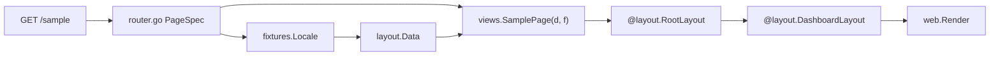

# Blank for React developers

Blank is a **server-rendered BFF frontend**: HTML is composed on the Go server with [templ](https://templ.guide/), styled with Tailwind, and served with static assets under `/static/`. It is not a client-side SPA, but the dev workflow is intentionally close to **Vite + SSR**.

If you know **Next App Router** and **shadcn/ui**, start here — you do not need to read framework internals to add a page.

## One-line mental model

```text
route -> PageSpec -> views.<Page>(d, f) -> RootLayout + TopnavLayout|DashboardLayout
```

Runtime routes live in [`internal/site/router.go`](../internal/site/router.go). Pages live in [`internal/views/*.templ`](../internal/views/). **Each page composes two layout layers** — `@layout.RootLayout(d.Document()) { @layout.TopnavLayout(d.Topnav()) { ... } }` for topnav, or `@layout.RootLayout(d.Document()) { @layout.DashboardLayout(d.Dashboard(title)) { ... } }` for dashboard layouts. Reusable UI lives in [`internal/ui/`](../internal/ui/). Copy lives in [`internal/fixtures/locale/`](../internal/fixtures/locale/).

The page file is the **single point of truth for the layout tree** — opening `views/sample.templ` shows `RootLayout + DashboardLayout + content` in one place, the same cognitive model as opening `app/dashboard/page.tsx` in a shadcn project.

Each route is one templ function `views.<Page>(d layout.Data, f fixtures.Locale)` registered directly in the router.

## File map

| Next / React + shadcn | Blank | Role |
|-----------------------|-------|------|
| `app/layout.tsx` (document frame) | [`internal/ui/layout/root_layout.templ`](../internal/ui/layout/root_layout.templ) → `layout.RootLayout` | Document frame — `html`, `head`, `body`, assets only |
| `app/(marketing)/layout.tsx` | [`internal/ui/layout/topnav_layout.templ`](../internal/ui/layout/topnav_layout.templ) → `layout.TopnavLayout` | Topnav chrome — header, main, footer, mobile sheet |
| `SidebarProvider + SidebarInset` | [`internal/ui/layout/dashboard_layout.templ`](../internal/ui/layout/dashboard_layout.templ) → `layout.DashboardLayout` | Dashboard chrome — TopnavLayout + desktop aside |
| `components/app-sidebar.tsx` | [`internal/ui/components/appsidebar/`](../internal/ui/components/appsidebar/) → `appsidebar.AppSidebar` | Local aside content (title + vertical nav); used inside `DashboardLayout` |
| `app/**/page.tsx` | [`internal/views/*.templ`](../internal/views/) | Page = layout composition + content (one file) |
| `components/ui/*` (shadcn primitives) | [`github.com/fastygo/templ/ui`](https://github.com/fastygo/templ) + [`templ/components`](https://github.com/fastygo/templ) | Atoms/molecules from templ |
| App components | [`internal/ui/components/*`](../internal/ui/components/) | App-owned components (icon, toggles, navigation, appsidebar) |
| shadcn blocks (full scaffolds) | [`internal/ui/blocks/marketing/hero/`](../internal/ui/blocks/marketing/hero/) | Copy-paste section with defaults (first live block) |
| Layout request data | [`internal/ui/layout/data.go`](../internal/ui/layout/data.go) → `layout.Data`, `Document()`, `Topnav()`, `Dashboard(title)` | Runtime layout props from request + fixtures |
| `vite.config.ts` | [`fastygo.config.mjs`](../fastygo.config.mjs) | **Tooling only** — server env, templ generate paths, CSS/JS build, ui8px validation. Not the route registry. |
| `messages/*.json` | [`internal/fixtures/locale/*.json`](../internal/fixtures/locale/) | Site copy per locale |
| Dev overlay i18n | [`internal/devoverlay/fixtures/locale/`](../internal/devoverlay/fixtures/locale/) | Separate from site fixtures |

## Request flow

Every page composes **two layout layers** inside the page template.

Example for `GET /sample` (dashboard app shell):

```text
GET /sample
  -> PageSpec in internal/site/router.go (Body: views.SamplePage)
  -> layout.BuildData → layout.Data
  -> fixtures.Locale (en/ru)
  -> views.SamplePage(d, f)
       -> @layout.RootLayout(d.Document()) {
            @layout.DashboardLayout(d.Dashboard(f.Sample.Title)) {
              ...page content...
            }
          }
  -> web.Render (full HTML response)
```

Example for `GET /` (topnav app shell):

```text
GET /
  -> PageSpec (Body: views.HomePage)
  -> views.HomePage(d, f)
       -> @layout.RootLayout(d.Document()) {
            @layout.TopnavLayout(d.Topnav()) { @hero.Hero(...) }
          }
```



**Layout layers:**

- `layout.RootLayout` — document frame only
- `layout.TopnavLayout` — header, main, footer, mobile sheet
- `layout.DashboardLayout` — TopnavLayout + desktop aside

Choose by **which `@layout.*` you write at the top of `views/<page>.templ`** — there is no `PageSpec.Layout` and no route adapter.

Architecture details: [`architecture.md`](./architecture.md).

## Runtime site package

| File | Role |
|------|------|
| [`internal/site/router.go`](../internal/site/router.go) | Route manifest — `PageSpec` entries with `Title`, `Body`, `Nav` |
| [`internal/site/render.go`](../internal/site/render.go) | `handlePage` — one `web.Render` call per request |
| [`internal/site/nav.go`](../internal/site/nav.go) | Header nav derived from `PageSpec.Nav` |
| [`internal/site/layout_data.go`](../internal/site/layout_data.go) | Thin wrapper → `layout.BuildData` |
| [`internal/site/feature.go`](../internal/site/feature.go) | Feature wiring — registers routes from the manifest |

There is **no** `routes.yaml` or codegen yet. Adding a route means editing Go in `router.go`.

## Tooling config vs runtime routing

[`fastygo.config.mjs`](../fastygo.config.mjs) is **dev/build tooling only** (server env, templ generate, Tailwind, JS bundles, ui8px validation). It is analogous to `vite.config.ts`, not to Next route groups or layout files.

| You want to change… | Edit… |
|---------------------|-------|
| Route URL, nav entry, page body | [`internal/site/router.go`](../internal/site/router.go) `PageSpec` |
| Layout for a route | Open `internal/views/<page>.templ` and change `@layout.TopnavLayout` / `@layout.DashboardLayout` |
| Page markup | [`internal/views/*.templ`](../internal/views/) |
| Aside content | [`internal/ui/components/appsidebar/`](../internal/ui/components/appsidebar/) |
| Document chrome | [`internal/ui/layout/`](../internal/ui/layout/) |
| Copy / i18n | [`internal/fixtures/locale/`](../internal/fixtures/locale/) |
| Dev server port, static dir, overlay | [`fastygo.config.mjs`](../fastygo.config.mjs) `server.env` |
| Tailwind input/output, lint paths | `fastygo.config.mjs` `css` / `ui8px` |

Do **not** add routes, layout presets, or `APP_LAYOUT` to config — that would create a second source of truth beside `router.go` and the page templates.

## Registry terms (shadcn-like)

Blank separates **runtime wiring**, **page composition**, and **reusable UI**:

| Term | Location | shadcn analogy |
|------|----------|----------------|
| **Root layout** | `internal/ui/layout/root_layout.templ` | `app/layout.tsx` |
| **Route layout** | `internal/ui/layout/topnav_layout.templ`, `dashboard_layout.templ` | `app/(group)/layout.tsx` |
| **Local aside** | `internal/ui/components/appsidebar/` | `components/app-sidebar.tsx` |
| **Page** | `internal/views/<page>.templ` | `page.tsx` — composes layout + content |
| **Components** | `internal/ui/components/*` | Small reusable UI; props in, markup out |
| **Blocks** | `internal/ui/blocks/*` | Full scaffolds — not adapter wrappers |
| **Widgets** | `internal/ui/widgets/*` | UI + behavior (fetch, state, orchestration) |

Kit primitives (`Button`, `Stack`, `Card`, `Sheet`, …) come from **`github.com/fastygo/templ`**. App-specific reusable mass accumulates under **`internal/ui/*`** until extraction.

See [`internal/ui/README.md`](../internal/ui/README.md) for the registry tree.

## Adding a page (cookbook)

Follow the existing `/sample` route as a template. For a hypothetical `/about` page (dashboard layout), touch these files in order:

| Step | File |
|------|------|
| Copy struct | [`internal/fixtures/fixtures.go`](../internal/fixtures/fixtures.go) — add `About` to `Locale` |
| i18n JSON | [`internal/fixtures/locale/en.json`](../internal/fixtures/locale/en.json) and [`ru.json`](../internal/fixtures/locale/ru.json) |
| Page template | `internal/views/about.templ` — `templ AboutPage(d layout.Data, f fixtures.Locale)` |
| Route | [`internal/site/router.go`](../internal/site/router.go) — `Body: views.AboutPage` |

### 1. Add copy to fixtures

Extend [`fixtures.Locale`](../internal/fixtures/fixtures.go) with a new struct (e.g. `About`) and add matching keys to **every** file in [`internal/fixtures/locale/`](../internal/fixtures/locale/) (`en.json`, `ru.json`, …).

### 2. Add the page template

`internal/views/about.templ` — the layout composition is right here:

```templ
templ AboutPage(d layout.Data, f fixtures.Locale) {
    @layout.RootLayout(d.Document()) {
        @layout.DashboardLayout(d.Dashboard(f.About.Title)) {
            @ui.Box(ui.BoxProps{Class: "..."}) {
                @ui.Title(ui.TitleProps{Order: 1}, f.About.Title)
                @ui.Text(ui.TextProps{}, f.About.Body)
            }
        }
    }
}
```

For a topnav-only page, use `@layout.TopnavLayout(d.Topnav()) { ... }` instead of `DashboardLayout`.

### 3. Register one route spec

Add one entry to `pages` in [`internal/site/router.go`](../internal/site/router.go):

```go
{
    Method:  "GET",
    Pattern: "/about",
    Active:  "/about",
    Title:   func(f fixtures.Locale) string { return f.About.Title },
    Body:    views.AboutPage,
    Nav: func(f fixtures.Locale) (layout.NavItem, bool) {
        return layout.NavItem{Label: f.About.NavLabel, Path: "/about", Icon: "info"}, true
    },
},
```

`Nav` is optional: omit it or return `false` for routes that should not appear in the header.

### 4. Rebuild and verify

```bash
bun run templ          # after .templ changes
bun run verify         # before landing the change
bun run dev            # restart if Go files changed
```

Refresh the browser (F5). There is no in-browser HMR for SSR HTML.

## Client interactivity

Use [`@ui8kit/aria`](../web/static/js/ui8kit.js) + `data-ui8kit` hooks for covered W3C patterns (dialog, sheet, tabs, …). Do not add custom JS for patterns already in the manifest ([`web/static/js/manifest.json`](../web/static/js/manifest.json)).

After changing markup hooks or bundle composition: `bun run build:js` then `bun run validate:aria`.

## Dev loop (honest)

### What `bun run dev` does today

[`scripts/dev.mjs`](../scripts/dev.mjs) runs **one-shot** builds, then starts the Go server:

```text
fastygo.config.mjs
       ↓
scripts/dev.mjs
  ├─ templ generate (initial)
  ├─ build CSS + JS (initial)
  ├─ dev overlay bundle (when APP_DEV_OVERLAY=1)
  └─ go run ./cmd/server
```

It does **not** watch `.templ` files or restart Go on `.go` changes.

### What to do when you edit

| You change | What to run |
|------------|-------------|
| `.templ` markup | `bun run templ`, then refresh browser (F5) |
| Tailwind classes | `bun run build:css`, then refresh |
| Go files (`router.go`, handlers, fixtures) | Stop dev (`Ctrl+C`), then `bun run dev` again |
| JS bundle / `@ui8kit/aria` patterns | `bun run build:js`, restart dev if needed |

**No HMR:** Blank uses SSR — the server renders full HTML documents. Rebuild artifacts on disk, then refresh the page to see changes. That is normal for this stack.

**No Go auto-restart** in v1.

Server URL defaults to [http://127.0.0.1:8080/](http://127.0.0.1:8080/). Override with `APP_BIND` in [`fastygo.config.mjs`](../fastygo.config.mjs) or the environment.

## Dev overlay

With `APP_DEV_OVERLAY=1` (enabled in [`fastygo.config.mjs`](../fastygo.config.mjs) for local dev), Blank injects a floating widget at SSR time. It does not modify `internal/views/**`.

- **Health:** browser probes for `/healthz` and `/readyz`
- **Assets:** server reports static file age; stale CSS hints `bun run build:css`
- **Request:** shows `X-Request-ID`, current path, and document locale

Click **Hide overlay** to opt out via cookie and reload.

## Verification

```bash
bun run verify
```

Pipeline: `templ generate` → Tailwind CSS → JS bundle → `ui8px lint` → `validate:aria` → `go test ./...`.

Run this before opening a PR or after large markup changes.

## Common commands

| Task | Command |
|------|---------|
| Dev server | `bun run dev` |
| Production binary | `bun run build` → `./blank` |
| Regenerate templ only | `bun run templ` |
| CSS one-shot | `bun run build:css` |
| Full check | `bun run verify` |
